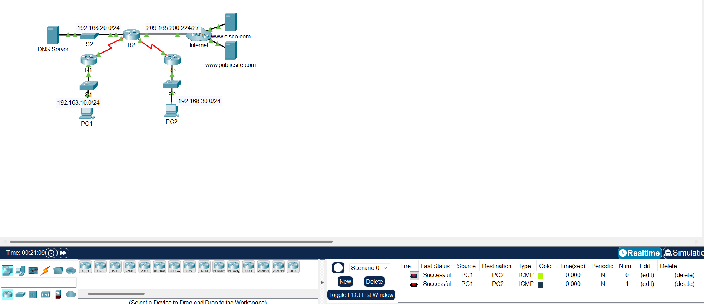
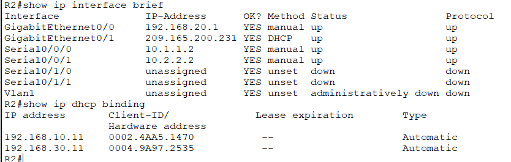

# Lab Report: Configuring DHCP Using Cisco IOS

**1. Objective**

The objective of this laboratory exercise was to configure a Cisco
router as a dynamic host configuration protocol (DHCP) server to provide
automated IP address allocation to local area network clients.
Additionally, the lab covered configuring routers as DHCP relay agents
(ip helper-address) across different network segments, setting up a
router interface as a DHCP client to acquire its own configuration from
an ISP network, and verifying end-to-end network connectivity and
address bindings.

**2. Network Addressing Table**

| **Device**     | **Interface** | **IPv4 Address**                | **Subnet Mask** | **Default Gateway** |
|----------------|---------------|---------------------------------|-----------------|---------------------|
| **R1**         | G0/0          | 192.168.10.1                    | 255.255.255.0   | N/A                 |
|                | S0/0/0        | 10.1.1.1                        | 255.255.255.252 | N/A                 |
| **R2**         | G0/0          | 192.168.20.1                    | 255.255.255.0   | N/A                 |
|                | G0/1          | DHCP Assigned (209.165.200.231) | 255.255.255.224 | DHCP Assigned       |
|                | S0/0/0        | 10.1.1.2                        | 255.255.255.252 | N/A                 |
|                | S0/0/1        | 10.2.2.2                        | 255.255.255.252 | N/A                 |
| **R3**         | G0/0          | 192.168.30.1                    | 255.255.255.0   | N/A                 |
|                | S0/0/1        | 10.2.2.1                        | 255.255.255.252 | N/A                 |
| **PC1**        | NIC           | DHCP Assigned (192.168.10.11)   | 255.255.255.0   | 192.168.10.1        |
| **PC2**        | NIC           | DHCP Assigned (192.168.30.11)   | 255.255.255.0   | 192.168.30.1        |
| **DNS Server** | NIC           | 192.168.20.254                  | 255.255.255.0   | 192.168.20.1        |

**3. Summary of Configuration Steps**

- **Step 1: Excluded Addresses on R2** — Configured R2 to reserve the
  first 10 IP addresses from both the R1 LAN
  (192.168.10.1–192.168.10.10) and R3 LAN (192.168.30.1–192.168.30.10).

- **Step 2 & 3: DHCP Pools on R2** — Created pools R1-LAN and R3-LAN
  specifying their respective network scopes, default gateways, and DNS
  server (192.168.20.254).

- **Step 4: DHCP Relay Agent Configuration** — Configured interface
  GigabitEthernet0/0 on both R1 and R3 with the ip helper-address
  10.1.1.2 and ip helper-address 10.2.2.2 commands respectively,
  allowing broadcast DHCP discovery packets to cross network boundaries
  to R2.

- **Step 5: Router as a DHCP Client** — Configured R2's
  GigabitEthernet0/1 interface with ip address dhcp to dynamically pull
  its internet-facing configuration from the upstream provider.

**4. Verification and Results**

- **DHCP Bindings:** Verified successful address leasing on R2 using
  show ip dhcp binding, confirming active leases assigned to PC1
  (192.168.10.11) and PC2 (192.168.30.11).

- **Connectivity Testing:** Performed successful ICMP ping tests between
  PC1 and PC2, validating that routing, helper addresses, and DHCP
  services are operating correctly across all connected subnets.

**5. Evidence of Completion (Screenshots)**

**  
Figure 1 Successful ICMP ping verification between PC1 and PC2 in Cisco
Packet Tracer**

**  
  
Figure 2:** R2 DHCP Client and EIGRP State Console Output.

**6. Conclusion & Reflection**

Completing this lab provided practical insight into how enterprise
environments manage IP address allocation dynamically without relying
entirely on dedicated standalone servers. Configuring Cisco IOS devices
as both DHCP servers and DHCP relay agents demonstrated how
broadcast-based protocols are handled across routed boundaries using
helper addresses. I also gained a solid understanding of configuring
router interfaces to act as DHCP clients. Overall, this exercise
reinforced core networking concepts regarding address pools, lease
management, and cross-subnet routing troubleshooting.

How would you like to export or save this report?
